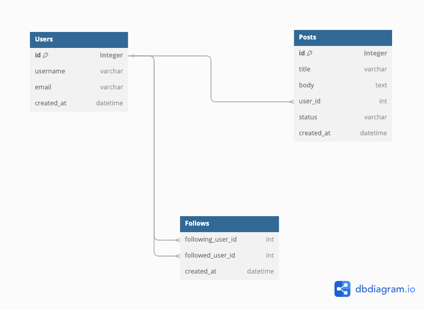
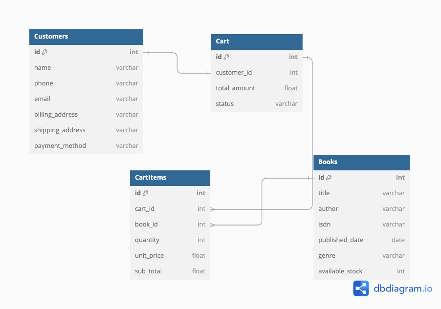

# Assignment

## Brief

Create an ERD for each of the following case study question.

## Instructions

Paste the answer as DBML in the answer code section below each question.

### Question 1

Construct an ERD for a social media company whose database includes information about users, their followers, and the posts that they make. Users can follow multiple users and create multiple posts.

Each entity has the following attributes:

- User: id, username, email, created_at
- Post: id, title, body, user_id, status, created_at
- Follows: following_user_id, followed_user_id, created_at

Answer:

```dbml
Table Users {
  id integer [primary key]
  username varchar
  email varchar
  created_at datetime
}

Table Posts {
  id integer [primary key]
  title varchar
  body text
  user_id int
  status varchar
  created_at datetime
}

Table Follows {
  following_user_id int
  followed_user_id int
  created_at datetime
}

Ref: "Users"."id" < "Posts"."user_id"

Ref: "Users"."id" < "Follows"."following_user_id"

Ref: "Users"."id" < "Follows"."followed_user_id"
```



### Question 2

Construct an ERD for a company that sells books online. The company has a website where customers can browse available books and add them to their shopping carts. Each cart can contain multiple books.

There are 4 entities, think of what attributes each entity should have.

- Customer
- Book
- Cart
- CartItem

Answer:

The following assumption are made:
- one customer only have one shopping cart

Given business rules:
- one cart can contain many cart items 

```dbml
Table Customers {
  id int [primary key]
  name varchar
  phone varchar
  email varchar
  billing_address varchar
  shipping_address varchar
  payment_method varchar
}

Table Cart {
  id int [primary key]
  customer_id int
  total_amount float
  status varchar
}

Table CartItems {
  id int [primary key]
  cart_id int
  book_id int
  quantity int
  unit_price float
  sub_total float
}

Table Books {
  id int [primary key]
  title varchar
  author varchar
  isdn varchar
  published_date date
  genre varchar
  available_stock int
}

Ref: "Customers"."id" - "Cart"."customer_id"

Ref: "Books"."id" < "CartItems"."book_id"

Ref: "Cart"."id" < "CartItems"."cart_id"
```



# Change my answer
## Submission

- Submit the URL of the GitHub Repository that contains your work to NTU black board.
- Should you reference the work of your classmate(s) or online resources, give them credit by adding either the name of your classmate or URL.
